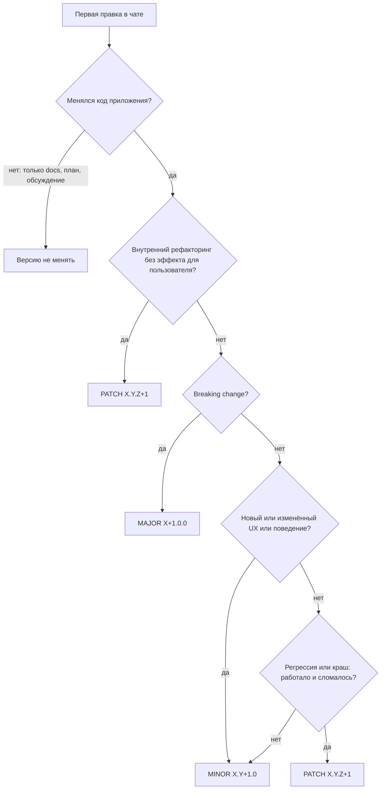

# Cadence — инструкции для агентов

## Документы

- Спецификация: [`SPEC.md`](SPEC.md)
- Дизайн: [`ux/`](ux/)

## Версионирование (SemVer)

Проект использует [Semantic Versioning 2.0.0](https://semver.org/lang/ru/): `MAJOR.MINOR.PATCH` (`X.Y.Z`).

### Где хранится версия

- **SemVer** — в `MARKETING_VERSION` в [`Cadence.xcodeproj/project.pbxproj`](Cadence.xcodeproj/project.pbxproj) (попадает в `CFBundleShortVersionString`). **Единственный источник правды** — прочитать все вхождения перед bump, не опираться на число в этом файле.
- **Build number** — в `CURRENT_PROJECT_VERSION` (целое число, `CFBundleVersion`); увеличивать при каждой сборке/релизе, не смешивать с semver.

Справочно (сверить с pbxproj): **1.2.0**.

### Когда версию не менять

**Не трогать `MARKETING_VERSION`**, если в чате менялись только:

- документы: `SPEC.md`, `AGENTS.md`, `ux/`, README и прочий markdown;
- обсуждение, план, review без правок кода приложения.

Код приложения — Swift, `project.pbxproj` (исходники/ресурсы/targets), entitlements, ассеты с логикой сборки и т.п.

### Алгоритм выбора bump

При **первой правке кода приложения** в новом чате:

1. Прочитать текущий `MARKETING_VERSION` в `project.pbxproj`.
2. **До первого edit кода** написать одну строку (пример):

   `SemVer bump: MINOR (1.2.0 → 1.3.0) — причина: …`

3. Пройти по схеме ниже и обновить все вхождения `MARKETING_VERSION` (Cadence и CadenceTests, Debug и Release).
4. В конце кратко повторить версию и обоснование.

### Компоненты X.Y.Z

| Компонент | Когда увеличивать | Пример |
|-----------|-------------------|--------|
| **X (MAJOR)** | Нарушена обратная совместимость: удалены или изменены публичные API, форматы данных, поведение, от которого могли зависеть пользователи | `1.4.2` → `2.0.0` |
| **Y (MINOR)** | Новый функционал, доработка **отсутствующей** логики, изменение пользовательского поведения (в т.ч. по явному запросу) | `1.2.0` → `1.3.0` |
| **Z (PATCH)** | Регрессия или краш (раньше работало → перестало), восстановление без смены задуманного UX; чистый рефакторинг без эффекта для пользователя | `1.3.0` → `1.3.1` |

### Правила Cadence

- **MINOR по умолчанию**, если пользователь что-то увидит или почувствует иначе.
- **«Не работает» ≠ PATCH.** Отсутствующая или непродуманная логика (shuffle при новой сессии, persistence избранного и т.п.) — **MINOR**, не багфикс.
- **PATCH** — только регрессия/краш, рефакторинг без смены UX, отладочная инструментация без смены UX.
- **Не опираться на формулировку задачи** («fix», «баг», «исправить») — классифицировать по **фактическому эффекту** для пользователя.

### Анти-паттерны

| Ошибка | Правильно |
|--------|-----------|
| Задача названа «fix» / «баг» → автоматически PATCH | Оценить эффект: новое/изменённое поведение → MINOR |
| «Исправление нежелательного автозапуска» → PATCH | Изменение поведения при запуске → MINOR |
| Shuffle «не применялся» → PATCH как баг | Логика не была реализована → MINOR |
| Правки только `SPEC.md` / `AGENTS.md` → PATCH | Код не менялся → **версию не менять** |

### Примеры

| Изменение | Bump |
|-----------|------|
| Только `SPEC.md` / `AGENTS.md` / `ux/` | **не менять** |
| Shuffle не применялся при новом альбоме (логика не была реализована) | MINOR |
| Отключение автовоспроизведения при запуске | MINOR |
| Jellyfin favorites не сохранялись (недоделанная persistence) | MINOR |
| Новый экран, новая интеграция | MINOR |
| Краш при `next()` в конце плейлиста | PATCH |
| Рефакторинг без изменения поведения | PATCH |
| Удаление поддержки старого формата плейлистов | MAJOR |

При сомнении между MINOR и PATCH — **MINOR**, если меняется или добавляется пользовательский функционал; **PATCH** — только если восстанавливается ранее работавшее без изменения задуманного UX.
