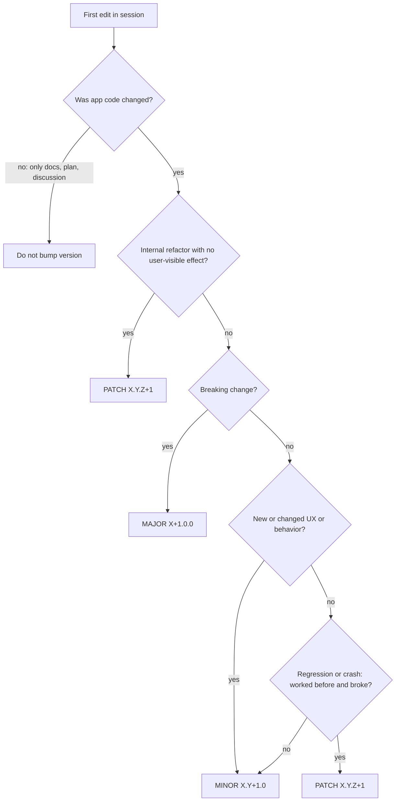

# Cadence — Agent Instructions

## Documents

- Specification / README: [`README.md`](README.md)
- Design: [`ux/`](ux/)

## Versioning (SemVer)

The project uses [Semantic Versioning 2.0.0](https://semver.org/): `MAJOR.MINOR.PATCH` (`X.Y.Z`).

### Where the version lives

- **SemVer** — in `MARKETING_VERSION` in [`Cadence.xcodeproj/project.pbxproj`](Cadence.xcodeproj/project.pbxproj) (maps to `CFBundleShortVersionString`). **Single source of truth** — read all occurrences before bumping; do not rely on the number in this file.
- **Build number** — in `CURRENT_PROJECT_VERSION` (integer, `CFBundleVersion`); increment on every build/release, do not mix with semver.

Reference (verify against pbxproj): **1.2.0**.

### When not to change the version

**Do not touch `MARKETING_VERSION`** if only the following changed in the session:

- documents: `README.md`, `AGENTS.md`, `ux/`, or other markdown;
- discussion, planning, review without any app code changes.

App code means Swift, `project.pbxproj` (sources/resources/targets), entitlements, assets with build logic, etc.

### Bump selection algorithm

On the **first app code change** in a new session:

1. Read the current `MARKETING_VERSION` in `project.pbxproj`.
2. **Before the first code edit**, write one line (example):

   `SemVer bump: MINOR (1.2.0 → 1.3.0) — reason: …`

3. Update all `MARKETING_VERSION` occurrences (Cadence and CadenceTests, Debug and Release).
4. At the end, briefly repeat the version and rationale.

### X.Y.Z components

| Component | When to increment | Example |
|-----------|-------------------|---------|
| **X (MAJOR)** | Backward compatibility broken: public APIs, data formats, or user-facing behavior removed or changed in a way users may depend on | `1.4.2` → `2.0.0` |
| **Y (MINOR)** | New functionality, implementation of previously missing logic, changed user-visible behavior (including explicit user requests) | `1.2.0` → `1.3.0` |
| **Z (PATCH)** | Regression or crash (worked before → stopped working), restoration without changing intended UX; pure refactor with no user-visible effect | `1.3.0` → `1.3.1` |

### Cadence rules

- **MINOR by default** when the user will see or feel something different.
- **"Doesn't work" ≠ PATCH.** Missing or poorly thought-out logic (shuffle in a new session, favorites persistence, etc.) is **MINOR**, not a bug fix.
- **PATCH** — only regressions/crashes, refactors with no UX change, debug instrumentation with no UX change.
- **Do not rely on task wording** ("fix", "bug", "correct") — classify by the **actual user-facing effect**.

### Anti-patterns

| Mistake | Correct |
|---------|---------|
| Task named "fix" / "bug" → automatically PATCH | Assess the effect: new or changed behavior → MINOR |
| "Fix unwanted auto-play" → PATCH | Behavior change on launch → MINOR |
| Shuffle "wasn't applied" → PATCH as a bug | Logic was never implemented → MINOR |
| Only `README.md` / `AGENTS.md` changes → PATCH | No code changed → **do not bump** |

### Examples

| Change | Bump |
|--------|------|
| Only `README.md` / `AGENTS.md` / `ux/` | **no bump** |
| Shuffle not applied on new album (logic was never implemented) | MINOR |
| Disable auto-play on launch | MINOR |
| Jellyfin favorites not saved (incomplete persistence) | MINOR |
| New screen, new integration | MINOR |
| Crash at `next()` at end of playlist | PATCH |
| Refactor with no behavior change | PATCH |
| Remove support for old playlist format | MAJOR |

When in doubt between MINOR and PATCH — **MINOR** if user functionality changes or is added; **PATCH** only if previously working behavior is restored without changing the intended UX.
