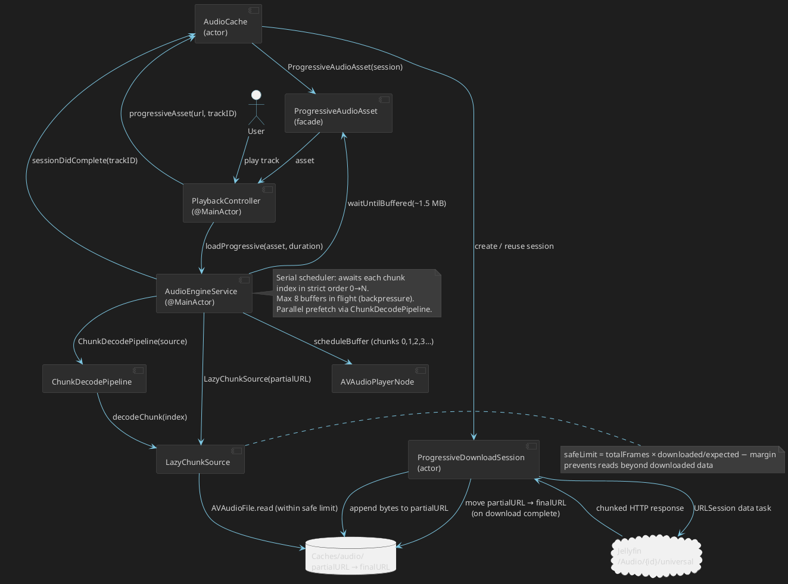
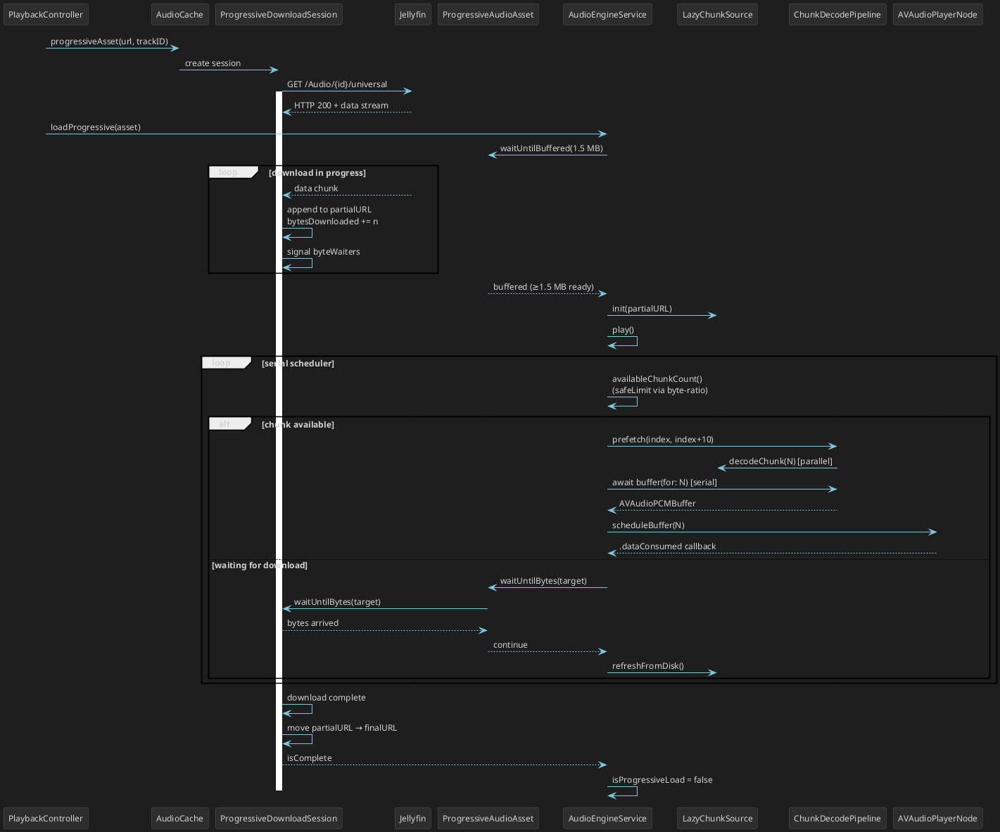

# Cadence

A native macOS audio player with Jellyfin server integration and local file support.

**Core values:** native macOS experience, stable playback, progressive Jellyfin track streaming without waiting for a full download.

---

## Tech Stack

| Component | Technology |
|---|---|
| Language | Swift |
| UI | SwiftUI |
| Audio engine | AVFoundation + Core Audio (AVAudioEngine) |
| Networking | URLSession / async-await |
| Persistence | UserDefaults + JSON in Application Support + FileManager (Caches) |
| Minimum macOS | 14.0 (Sonoma) |
| External dependencies | None. Jellyfin API — custom client on top of REST API |

---

## Audio Sources

### Jellyfin

- **Authentication**: username/password or API key; tokens stored in Keychain; server list in UserDefaults; one active server at a time
- **Library**: all audio items loaded via REST API, grouped by albums, artist list built; library cache stored on disk (Application Support)
- **Streaming**: progressive — playback begins after buffering the first ~1.5 MB while the file continues downloading (see section 7)
- **Favorites**: local storage + mark/unmark sync with server and initial load of favorited tracks

Not implemented:
- Jellyfin playlists (CRUD) and ratings
- Scrobbling
- Explicit codec/transcoding selection — uses the universal endpoint `/Audio/{id}/universal`

### Local Files

- Add via File → Open Music Folder… (⌘O)
- Recursive scan of selected folder and subfolders
- Supported formats: FLAC, ALAC, MP3, AAC, M4A, OGG, WAV, AIFF/AIF, Opus
- Metadata read from file tags via AVFoundation
- Security-scoped bookmarks for cross-session access restoration

---

## Playback

### Audio Engine

Built on **AVAudioEngine**.

Signal chain: `AVAudioPlayerNode` → `AVAudioUnitEQ` → `AVAudioEngine.mainMixerNode` → output.

A track is split into chunks of ~1 second (equal to the sample rate in frames). Each chunk is decoded via `AVAudioFile` into an `AVAudioPCMBuffer`. Buffers are scheduled into `AVAudioPlayerNode` in strictly ascending index order — this guarantees correct playback order.

Parallel prefetch of chunks (up to 10 ahead) speeds up decoding, but they always enter the player sequentially through a single serial scheduler.

### Playback Controls

- Play / Pause
- Next / Previous track
- Seek with position display
- Volume control (independent of system volume)
- Playback queue: add, remove, drag to reorder in Up Next
- "Play Next" / "Add to Queue" — from track context menu

### Playback Modes

- **Repeat**: off / repeat queue / repeat one track
- **Shuffle**: off / on (randomizes remaining tracks)

### Gapless Playback

Not implemented. The transition occurs after the current track ends; the next track begins loading after the current one starts playing.

---

## Equalizer

### Type

Graphic equalizer: **10 bands** (32, 64, 125, 250, 500, 1K, 2K, 4K, 8K, 16K Hz). Implemented via `AVAudioUnitEQ` with filter type `.parametric`. Gain range in UI: −12 dB to +12 dB.

### Presets

Built-in presets: Flat, Rock, Pop, Jazz, Classical, Electronic, Hip-Hop, Acoustic, Bass Boost, Vocal Boost.

Custom user presets are not implemented (manual adjustment only with current values saved).

### EQ UI

- Separate window, accessible from the toolbar (⌘E)
- 10 vertical sliders with frequency labels
- Preset dropdown
- Enable/disable button (bypass)
- Frequency response curve not implemented

---

## Album Artwork

### Sources (by priority)

1. Jellyfin API: `/Items/{id}/Images/Primary`
2. Embedded in file metadata
3. Files alongside audio: `cover.jpg/png`, `folder.jpg/png`, `front.jpg/png`, `artwork.jpg/png`

### Display

- Large artwork in the Now Playing panel
- Thumbnails in track and album lists
- Placeholder (music note icon) for tracks without artwork

### Caching

- Jellyfin artwork cached to disk (`~/Library/Caches/Cadence/artwork/`)
- In-memory `NSCache` (countLimit = 200)
- Reduced-size image requested from Jellyfin; original is not downloaded

---

## Audio Cache and Progressive Streaming

### Two Loading Paths for Jellyfin Tracks

`PlaybackController` via `AudioCache` determines the source each time a track is started:

1. **File already cached** → `AudioEngineService.load(url:)` — loads local file directly
2. **File not cached** → `AudioCache.progressiveAsset(...)` → `AudioEngineService.loadProgressive(asset:)` — progressive playback

### Progressive Streaming

Implemented via `ProgressiveDownloadSession` (actor) and `ProgressiveAudioAsset` (facade).

**Process:**

1. `AudioCache` creates a `ProgressiveDownloadSession` — it immediately opens a `URLSession` data task to `/Audio/{id}/universal` and begins writing bytes to a temporary file (`partialURL`) on disk
2. `loadProgressive` waits for the first ~1.5 MB (`waitUntilBuffered`), then opens a `LazyChunkSource` on this partial file and begins playback
3. The serial scheduler in `AudioEngineService` reads chunks as they become available:
   - If the next chunk isn't downloaded yet — waits via `asset.waitUntilBytes(...)` (backpressure without polling)
   - When enough bytes are available — decodes and passes to `AVAudioPlayerNode`
4. Background monitor (`startProgressiveMonitoring`) updates `LazyChunkSource` from disk every 250 ms — refreshes the available frame count
5. After download completes: `ProgressiveDownloadSession` moves the file from `partialURL` to permanent cache; `AudioEngineService` switches to local file mode

**Key safeguards:**

- **Byte-ratio safe limit**: for FLAC, `AVAudioFile.length` returns the full track length (from the STREAMINFO header), even for a partial file. `LazyChunkSource` calculates the actually readable boundary via the downloaded/expected byte ratio: `safeFrames = totalFrames × (downloadedBytes / expectedBytes) − margin`
- **Safety margin**: 22,050 frames (~0.5 s) from the calculated boundary prevents reading unwritten data
- **Backpressure**: no more than 8 buffers in the player at once — prevents memory exhaustion on long tracks

### Audio Cache

- Disk: `~/Library/Caches/dev.personal.cadence/audio/`
- Limit: 2 GB (set in code)
- Eviction: LRU by access date on each new download

### Next-Track Prefetch

After playback starts, `PlaybackController` launches a background download of the next remote track via `AudioCache.localURL(...)`. If the download completes before switching — the track starts as local (no progressive buffering needed).

### Offline Mode

No dedicated offline mode. Already cached tracks play without a network connection. The "Downloaded" section shows user's local folders, not Jellyfin downloads.

---

## UI / UX

### Window Structure

```
┌─────────────────────────────────────────────────────────────────┐
│  Toolbar: back/forward navigation, search                        │
├───────────┬──────────────────────────────┬──────────────────────┤
│           │                              │                      │
│  Sidebar  │        Content Area          │    Queue Panel       │
│           │  (albums / artists / tracks  │   (optional)         │
│  - Now    │   / playlists / favorites /  │                      │
│    Playing│   recent / downloaded)       │                      │
│  - Library│                              │                      │
│  - Playl. │                              │                      │
│  - Favs   │                              │                      │
│           │                              │                      │
├───────────┴──────────────────────────────┴──────────────────────┤
│  Now Playing Bar: artwork, track/artist, controls, progress,     │
│  volume, shuffle, repeat, queue, EQ                              │
└─────────────────────────────────────────────────────────────────┘
```

### Sidebar Navigation

- **Now Playing** — detailed Now Playing view
- **Library**: All Tracks / Albums / Artists
- **Playlists**: local playlists + "New Playlist"
- **Favorites**
- **Recent**
- **Downloaded** (user's local folders)

### Content Area

- **Track list**: columns (#, title, album, duration); context menu: play, play next, add to queue, add to playlist, favorite, show in Finder
- **Album grid**: artwork with title and artist → album page
- **Artist grid**: navigate to artist
- **Album page**: artwork, metadata, tracklist
- **Playlist**: tracks from a local playlist
- **Favorites / Recent / Downloaded**: track lists

Column sorting is not implemented.

### Now Playing Bar (bottom panel)

Always visible when something is loaded:

- Artwork (thumbnail) + track title + artist (click → go to Now Playing)
- Buttons: previous, play/pause, next
- Progress bar (seekable) with current time and duration
- Buffering indicator (during progressive streaming)
- Volume slider
- Buttons: shuffle, repeat (with current mode indicator)
- Queue button (opens Queue Panel)
- EQ button
- Favorite button for the current track

### Search

Filters the local library by tracks, albums, and artists. Jellyfin server-side search is not implemented.

---

## macOS System Integration

### Media Keys and Now Playing

- Media key interception via `MPRemoteCommandCenter` + local `NSEvent` monitor
- `MPNowPlayingInfoCenter`: title, artist, album, duration, position
- Artwork in the system Now Playing widget is not set

### App Menu

- **Cadence**: About, Preferences (⌘,), Quit (⌘Q)
- **File**: Open Music Folder… (⌘O)
- **Playback**: Play/Pause (Space), Next Track, Previous Track
- **View**: Toggle Sidebar (⌘B), Toggle Queue (⌘L), Show Equalizer (⌘E)
- **Window**: standard macOS window commands

### Keyboard Shortcuts

| Action | Key |
|---|---|
| Play / Pause | Space |
| Preferences | ⌘, |
| Open Music Folder | ⌘O |
| Toggle Sidebar | ⌘B |
| Toggle Queue | ⌘L |
| Equalizer | ⌘E |

### Not Implemented

- Dock menu (standard behavior)
- Drag & Drop from Finder

---

## Settings

- **Servers**: list of Jellyfin servers, add/remove, select active
- **Playback**: UI settings (values do not affect the engine)
- **Cache**: total size (artwork + audio + library), clear; max size slider is not applied to `AudioCache`
- **Appearance**: system / light / dark (state stored in memory, not persisted)

---

## State Persistence

On app restart, the following are restored:

- Current track and playback position
- Playback queue (Up Next + autoplay)
- Shuffle / repeat modes
- Equalizer settings (gains, enabled state)
- Volume

Storage:
- `UserDefaults`: playback state, favorites, recent tracks, servers, folder bookmarks
- `Application Support/Cadence`: `playlists.json`, Jellyfin library cache
- `~/Library/Caches`: artwork, audio

---

## Error Handling

- Network/decoding errors logged via `os_log`
- Track load error → log + skip to next track
- State restore error → queue reset
- UI notifications and retry are not implemented

---

## Architecture

### Core Modules

- **SwiftUI Views**: `MainWindowView`, `SidebarView`, `ContentAreaView`, `NowPlayingBarView`, `NowPlayingDetailView`, `QueuePanelView`, `EQWindowView`, `PreferencesWindowView`
- **State / Stores**: `AppUIState`, `LibraryStore`, `PlaylistStore`, `FavoritesStore`, `RecentStore`, `PlaybackStateStore`
- **Playback**: `PlaybackController` → `AudioEngineService` (+ `ChunkDecodePipeline`, `LazyChunkSource`)
- **Cache**: `AudioCache` → `ProgressiveDownloadSession` / `ProgressiveAudioAsset`
- **Jellyfin**: `JellyfinClient`, `JellyfinLibraryLoader`, `JellyfinFavoritesSync`
- **Caches**: `ArtworkCache`, `JellyfinLibraryCache`
- **System**: `MediaRemoteService`, `PlaybackKeyboardMonitor`

### Data Flow

- UI reacts to Observable objects via `@Environment`
- `PlaybackController` — single control point for audio, queue, repeat/shuffle, and state persistence
- `LibraryStore` combines local and Jellyfin tracks into a single unified list

### Progressive Streaming and Cache — Diagrams

**Components and interactions**



**Jellyfin track playback sequence**



### Component and Storage Diagram

```plantuml
@startuml
skinparam backgroundColor #1e1e1e
skinparam defaultFontColor #d4d4d4
skinparam defaultFontSize 12
skinparam arrowColor #7ec8e3
skinparam componentBorderColor #555555
skinparam componentBackgroundColor #2d2d2d
skinparam componentFontColor #d4d4d4
skinparam databaseBorderColor #555555
skinparam databaseBackgroundColor #2d2d2d
skinparam packageBorderColor #444444

package "UI" {
    [SwiftUI Views]
}

package "State / Stores" {
    [AppUIState]
    [LibraryStore]
    [PlaylistStore]
    [FavoritesStore]
    [RecentStore]
    [PlaybackStateStore]
}

package "Playback" {
    [PlaybackController]
    [AudioEngineService]
    [AudioCache]
    [ProgressiveDownloadSession]
}

package "Jellyfin" {
    [JellyfinClient]
    [JellyfinLibraryLoader]
    [JellyfinFavoritesSync]
}

package "Caches" {
    [ArtworkCache]
    [JellyfinLibraryCache]
}

database "UserDefaults" as UD
database "Application Support\n(playlists.json,\njellyfin cache)" as AS
database "~/Library/Caches\n(audio/, artwork/)" as Caches
database "Keychain" as KC
database "Memory\n(PlaybackQueue,\nNSCache artwork,\nPCM chunks)" as Mem

[SwiftUI Views] --> [AppUIState]
[SwiftUI Views] --> [LibraryStore]
[SwiftUI Views] --> [PlaybackController]
[SwiftUI Views] --> [PlaylistStore]
[SwiftUI Views] --> [FavoritesStore]
[SwiftUI Views] --> [RecentStore]

[PlaybackController] --> [AudioEngineService]
[PlaybackController] --> [AudioCache]
[PlaybackController] --> [PlaybackStateStore]
[PlaybackController] --> Mem

[AudioCache] --> [ProgressiveDownloadSession]
[AudioEngineService] --> Mem

[AppUIState] --> UD
[FavoritesStore] --> UD
[RecentStore] --> UD
[PlaybackStateStore] --> UD
[LibraryStore] --> UD

[PlaylistStore] --> AS
[JellyfinLibraryCache] --> AS

[JellyfinClient] --> KC
[ArtworkCache] --> Mem
[ArtworkCache] --> Caches
[AudioCache] --> Caches
[ProgressiveDownloadSession] --> Caches
@enduml
```

---

## Implementation Status

Implemented:

1. SwiftUI shell: window, sidebar, content area, Now Playing Bar
2. Jellyfin connection (username/password, API key), on-disk library cache
3. Local library from folders with security-scoped bookmarks
4. Progressive Jellyfin track streaming (playback during download)
5. LRU audio cache with next-track prefetch
6. Playback queue, shuffle / repeat
7. 10-band equalizer + built-in presets
8. Favorites (local + Jellyfin sync)
9. Local playlists
10. Media keys + `MPNowPlayingInfoCenter`
11. State save and restore between launches

Not implemented:

- Jellyfin playlists, ratings, scrobbling
- Offline mode and explicit downloads
- Gapless / crossfade playback
- Jellyfin server-side search
- Custom EQ presets and EQ curve visualization
- Drag & Drop from Finder, Dock menu
- Mini player

---

## License

MIT — see [LICENSE](LICENSE).
