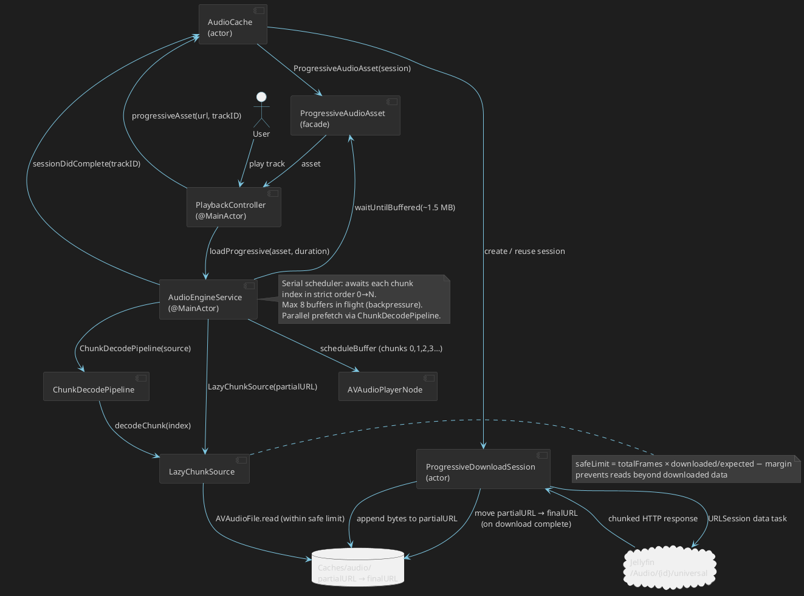
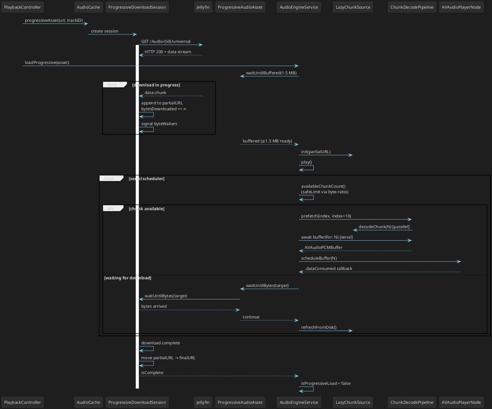

# Cadence — Техническое задание

## 1. Обзор

**Cadence** — нативный аудио-плеер для macOS с интеграцией с Jellyfin-сервером и поддержкой локальных файлов.

Ключевые ценности: нативный macOS-опыт, стабильное воспроизведение, прогрессивный стриминг Jellyfin-треков без ожидания полной загрузки.

---

## 2. Технический стек

| Компонент | Технология |
|---|---|
| Язык | Swift |
| UI | SwiftUI |
| Аудио-движок | AVFoundation + Core Audio (AVAudioEngine) |
| Сеть | URLSession / async-await |
| Persistence | UserDefaults + JSON в Application Support + FileManager (Caches) |
| Минимальная macOS | 14.0 (Sonoma) |
| Внешние зависимости | Нет. Jellyfin API — собственный клиент поверх REST API |

---

## 3. Источники аудио

### 3.1 Jellyfin

- **Аутентификация**: логин/пароль или API key; токены сохраняются в Keychain; список серверов в UserDefaults; активный сервер один
- **Библиотека**: загрузка всех аудио-объектов через REST API, группировка по альбомам, формирование списка артистов; кеш библиотеки хранится на диске (Application Support)
- **Стриминг**: прогрессивный — воспроизведение начинается после буферизации первых ~1.5 МБ, пока файл продолжает скачиваться (см. раздел 7)
- **Избранное**: локальное хранение + синхронизация mark/unmark с сервером и первичная загрузка избранных треков

Не реализовано:
- Плейлисты Jellyfin (CRUD) и рейтинги
- Scrobbling
- Явный выбор кодека/транскодинга — используется универсальный endpoint `/Audio/{id}/universal`

### 3.2 Локальные файлы

- Добавление через File → Open Music Folder… (⌘O)
- Сканирование выбранной папки и подпапок рекурсивно
- Поддерживаемые форматы: FLAC, ALAC, MP3, AAC, M4A, OGG, WAV, AIFF/AIF, Opus
- Чтение метаданных из тегов файлов через AVFoundation
- Security-scoped bookmarks для восстановления доступа между сессиями

---

## 4. Воспроизведение

### 4.1 Аудио-движок

Построен на **AVAudioEngine**.

Цепочка сигнала: `AVAudioPlayerNode` → `AVAudioUnitEQ` → `AVAudioEngine.mainMixerNode` → `output`.

Трек делится на чанки по ~1 сек (равно sample rate в кадрах). Каждый чанк декодируется через `AVAudioFile` в `AVAudioPCMBuffer`. Буферы планируются в `AVAudioPlayerNode` строго по возрастанию индекса — этим гарантируется правильный порядок воспроизведения.

Параллельный prefetch чанков (до 10 вперёд) ускоряет декодирование, но в плеер они попадают всегда последовательно через единственный серийный планировщик.

### 4.2 Управление воспроизведением

- Play / Pause
- Next / Previous трек
- Seek (перемотка) с отображением позиции
- Регулировка громкости (независимая от системной)
- Очередь воспроизведения: добавление, удаление, перетаскивание в Up Next
- «Играть следующим» / «Добавить в очередь» — из контекстного меню трека

### 4.3 Режимы воспроизведения

- **Repeat**: выключен / повтор очереди / повтор одного трека
- **Shuffle**: выключен / включён (перемешивание оставшихся треков)

### 4.4 Gapless playback

Не реализован. Переход происходит после завершения текущего трека, следующий начинает загрузку после старта воспроизведения текущего.

---

## 5. Эквалайзер

### 5.1 Тип

Графический эквалайзер: **10 полос** (32, 64, 125, 250, 500, 1K, 2K, 4K, 8K, 16K Гц). Реализован через `AVAudioUnitEQ` с типом фильтра `.parametric`. Диапазон gain в UI: от −12 dB до +12 dB.

### 5.2 Пресеты

Встроенные пресеты: Flat, Rock, Pop, Jazz, Classical, Electronic, Hip-Hop, Acoustic, Bass Boost, Vocal Boost.

Пользовательские пресеты не реализованы (только ручная настройка с сохранением текущих значений).

### 5.3 UI эквалайзера

- Отдельное окно, вызываемое из тулбара (⌘E)
- 10 вертикальных слайдеров с подписями частот
- Выпадающий список пресетов
- Кнопка вкл/выкл (bypass)
- Визуальная кривая частотного отклика не реализована

---

## 6. Обложки альбомов

### 6.1 Источники (по приоритету)

1. Jellyfin API: `/Items/{id}/Images/Primary`
2. Встроенные в метаданные файла (embedded artwork)
3. Файлы рядом с аудио: `cover.jpg/png`, `folder.jpg/png`, `front.jpg/png`, `artwork.jpg/png`

### 6.2 Отображение

- Крупная обложка в панели «Сейчас играет»
- Миниатюры в списках треков и альбомов
- Плейсхолдер (нотная иконка) для треков без обложки

### 6.3 Кеширование

- Обложки из Jellyfin кешируются на диск (`~/Library/Caches/Cadence/artwork/`)
- В памяти — `NSCache` (countLimit = 200)
- Запрашивается уменьшенный размер у Jellyfin, оригинал не загружается

---

## 7. Кеширование аудио и прогрессивный стриминг

### 7.1 Два пути загрузки для Jellyfin-треков

`PlaybackController` через `AudioCache` определяет источник при каждом запуске трека:

1. **Файл уже в кеше** → `AudioEngineService.load(url:)` — загрузка локального файла напрямую
2. **Файл не кеширован** → `AudioCache.progressiveAsset(...)` → `AudioEngineService.loadProgressive(asset:)` — прогрессивное воспроизведение

### 7.2 Прогрессивный стриминг

Реализован через `ProgressiveDownloadSession` (actor) и `ProgressiveAudioAsset` (фасад).

**Процесс:**

1. `AudioCache` создаёт `ProgressiveDownloadSession` — тот немедленно открывает `URLSession` data task на `/Audio/{id}/universal` и начинает писать байты в временный файл (`partialURL`) на диске
2. `loadProgressive` ждёт первых ~1.5 МБ (`waitUntilBuffered`), затем открывает `LazyChunkSource` на этот частичный файл и начинает воспроизведение
3. Серийный планировщик в `AudioEngineService` читает чанки по мере их доступности:
   - Если следующий чанк ещё не скачан — ждёт через `asset.waitUntilBytes(...)` (backpressure без поллинга)
   - Когда байтов достаточно — декодирует и передаёт в `AVAudioPlayerNode`
4. Фоновый монитор (`startProgressiveMonitoring`) каждые 250 мс обновляет `LazyChunkSource` с диска — актуализирует количество доступных кадров
5. После завершения скачивания: `ProgressiveDownloadSession` перемещает файл из `partialURL` в постоянный кеш; `AudioEngineService` переключается в режим локального файла

**Ключевые защиты:**

- **Byte-ratio safe limit**: для FLAC `AVAudioFile.length` возвращает полную длину трека (из STREAMINFO-заголовка), даже если файл частичный. `LazyChunkSource` вычисляет реально читаемую границу через соотношение скачанных/ожидаемых байт: `safeFrames = totalFrames × (downloadedBytes / expectedBytes) − margin`
- **Безопасный отступ**: 22 050 кадров (~0.5 с) от вычисленной границы предотвращают чтение незаписанных данных
- **Backpressure**: в плеере одновременно не более 8 буферов — предотвращает расход памяти на длинных треках

### 7.3 Кеш аудио

- Диск: `~/Library/Caches/dev.personal.cadence/audio/`
- Лимит: 2 ГБ (задан в коде)
- Вытеснение: LRU по дате доступа при каждом новом скачивании

### 7.4 Prefetch следующего трека

После старта воспроизведения `PlaybackController` запускает фоновую загрузку следующего удалённого трека через `AudioCache.localURL(...)`. Если загрузка успевает завершиться до переключения — трек стартует как локальный (без прогрессивного буферизации).

### 7.5 Офлайн-режим

Отдельного офлайн-режима нет. Уже скешированные треки воспроизводятся без сети. Раздел «Скачанное» показывает локальные папки пользователя, а не Jellyfin-загрузки.

---

## 8. UI / UX

### 8.1 Структура окна

```
┌─────────────────────────────────────────────────────────────────┐
│  Toolbar: навигация назад/вперёд, поиск                         │
├───────────┬──────────────────────────────┬──────────────────────┤
│           │                              │                      │
│  Sidebar  │        Content Area          │    Queue Panel       │
│           │  (альбомы / артисты / треки  │   (опционально)      │
│  - Сейчас │   / плейлисты / избранное /  │                      │
│    играет │   недавнее / скачанное)      │                      │
│  - Библ.  │                              │                      │
│  - Плейл. │                              │                      │
│  - Избр.  │                              │                      │
│           │                              │                      │
├───────────┴──────────────────────────────┴──────────────────────┤
│  Now Playing Bar: обложка, трек/артист, controls, прогресс,     │
│  громкость, shuffle, repeat, queue, EQ                          │
└─────────────────────────────────────────────────────────────────┘
```

### 8.2 Навигация в Sidebar

- **Сейчас играет** — детальный Now Playing
- **Библиотека**: Все треки / Альбомы / Артисты
- **Плейлисты**: локальные плейлисты + «Создать плейлист»
- **Избранное**
- **Недавнее**
- **Скачанное** (локальные папки пользователя)

### 8.3 Content Area

- **Список треков**: колонки (#, название, альбом, длительность); контекстное меню: play, play next, add to queue, add to playlist, favorite, показать в Finder
- **Сетка альбомов**: обложки с названием и артистом → страница альбома
- **Сетка артистов**: переход к артисту
- **Страница альбома**: обложка, метаданные, треклист
- **Плейлист**: список треков из локального плейлиста
- **Избранное / Недавнее / Скачанное**: списки треков

Сортировка по колонкам не реализована.

### 8.4 Now Playing Bar (нижняя панель)

Всегда видна, когда что-то загружено:

- Обложка (миниатюра) + название трека + артист (клик → переход к «Сейчас играет»)
- Кнопки: previous, play/pause, next
- Прогресс-бар (seekable) с текущим временем и длительностью
- Индикатор буферизации (при прогрессивной загрузке)
- Громкость (слайдер)
- Кнопки: shuffle, repeat (с индикацией текущего режима)
- Кнопка очереди (открывает Queue Panel)
- Кнопка EQ
- Кнопка избранного для текущего трека

### 8.5 Поиск

Фильтрация локальной библиотеки по трекам, альбомам, артистам. Серверный поиск Jellyfin не реализован.

---

## 9. Системная интеграция macOS

### 9.1 Media Keys и Now Playing

- Перехват media keys через `MPRemoteCommandCenter` + локальный монитор `NSEvent`
- `MPNowPlayingInfoCenter`: название, артист, альбом, длительность, позиция
- Обложка в системном Now Playing не задаётся

### 9.2 Меню приложения

- **Cadence**: About, Preferences (⌘,), Quit (⌘Q)
- **File**: Open Music Folder… (⌘O)
- **Playback**: Play/Pause (Space), Next Track, Previous Track
- **View**: Toggle Sidebar (⌘B), Toggle Queue (⌘L), Show Equalizer (⌘E)
- **Window**: стандартные macOS window commands

### 9.3 Горячие клавиши

| Действие | Клавиша |
|---|---|
| Play / Pause | Space |
| Preferences | ⌘, |
| Open Music Folder | ⌘O |
| Toggle Sidebar | ⌘B |
| Toggle Queue | ⌘L |
| Equalizer | ⌘E |

### 9.4 Не реализовано

- Dock menu (стандартное поведение)
- Drag & Drop из Finder

---

## 10. Настройки

- **Серверы**: список Jellyfin-серверов, добавление/удаление, выбор активного
- **Воспроизведение**: UI-настройки (значения не влияют на движок)
- **Кеш**: суммарный размер (artwork + audio + library), очистка; слайдер максимального размера не применяется к `AudioCache`
- **Внешний вид**: system / light / dark (состояние хранится в памяти, не персистируется)

---

## 11. Сохранение состояния

При перезапуске приложения восстанавливаются:

- Текущий трек и позиция воспроизведения
- Очередь воспроизведения (Up Next + autoplay)
- Режимы shuffle / repeat
- Настройки эквалайзера (gains, enabled)
- Громкость

Хранение:
- `UserDefaults`: playback state, избранное, недавние треки, серверы, bookmarks папок
- `Application Support/Cadence`: `playlists.json`, кеш библиотеки Jellyfin
- `~/Library/Caches`: artwork, audio

---

## 12. Обработка ошибок

- Ошибки сети/декодирования логируются через `os_log`
- Ошибка загрузки трека → лог + переход к следующему треку
- Ошибка восстановления состояния → сброс очереди
- UI-уведомления и retry не реализованы

---

## 13. Архитектура

### 13.1 Основные модули

- **SwiftUI Views**: `MainWindowView`, `SidebarView`, `ContentAreaView`, `NowPlayingBarView`, `NowPlayingDetailView`, `QueuePanelView`, `EQWindowView`, `PreferencesWindowView`
- **State / Stores**: `AppUIState`, `LibraryStore`, `PlaylistStore`, `FavoritesStore`, `RecentStore`, `PlaybackStateStore`
- **Playback**: `PlaybackController` → `AudioEngineService` (+ `ChunkDecodePipeline`, `LazyChunkSource`)
- **Cache**: `AudioCache` → `ProgressiveDownloadSession` / `ProgressiveAudioAsset`
- **Jellyfin**: `JellyfinClient`, `JellyfinLibraryLoader`, `JellyfinFavoritesSync`
- **Caches**: `ArtworkCache`, `JellyfinLibraryCache`
- **System**: `MediaRemoteService`, `PlaybackKeyboardMonitor`

### 13.2 Потоки данных

- UI реагирует на Observable-объекты через `@Environment`
- `PlaybackController` — единая точка управления аудио, очередью, repeat/shuffle и сохранением состояния
- `LibraryStore` объединяет локальные и Jellyfin-треки в единый список

### 13.3 Прогрессивный стриминг и кеш — диаграммы

**Компоненты и взаимодействия**



**Последовательность воспроизведения Jellyfin-трека**



### 13.4 Диаграмма компонентов и хранилищ

```plantuml
@startuml
skinparam backgroundColor #1e1e1e
skinparam defaultFontColor #d4d4d4
skinparam defaultFontSize 12
skinparam arrowColor #7ec8e3
skinparam componentBorderColor #555555
skinparam componentBackgroundColor #2d2d2d
skinparam componentFontColor #d4d4d4
skinparam databaseBorderColor #555555
skinparam databaseBackgroundColor #2d2d2d
skinparam packageBorderColor #444444

package "UI" {
    [SwiftUI Views]
}

package "State / Stores" {
    [AppUIState]
    [LibraryStore]
    [PlaylistStore]
    [FavoritesStore]
    [RecentStore]
    [PlaybackStateStore]
}

package "Playback" {
    [PlaybackController]
    [AudioEngineService]
    [AudioCache]
    [ProgressiveDownloadSession]
}

package "Jellyfin" {
    [JellyfinClient]
    [JellyfinLibraryLoader]
    [JellyfinFavoritesSync]
}

package "Caches" {
    [ArtworkCache]
    [JellyfinLibraryCache]
}

database "UserDefaults" as UD
database "Application Support\n(playlists.json,\njellyfin cache)" as AS
database "~/Library/Caches\n(audio/, artwork/)" as Caches
database "Keychain" as KC
database "Memory\n(PlaybackQueue,\nNSCache artwork,\nPCM chunks)" as Mem

[SwiftUI Views] --> [AppUIState]
[SwiftUI Views] --> [LibraryStore]
[SwiftUI Views] --> [PlaybackController]
[SwiftUI Views] --> [PlaylistStore]
[SwiftUI Views] --> [FavoritesStore]
[SwiftUI Views] --> [RecentStore]

[PlaybackController] --> [AudioEngineService]
[PlaybackController] --> [AudioCache]
[PlaybackController] --> [PlaybackStateStore]
[PlaybackController] --> Mem

[AudioCache] --> [ProgressiveDownloadSession]
[AudioEngineService] --> Mem

[AppUIState] --> UD
[FavoritesStore] --> UD
[RecentStore] --> UD
[PlaybackStateStore] --> UD
[LibraryStore] --> UD

[PlaylistStore] --> AS
[JellyfinLibraryCache] --> AS

[JellyfinClient] --> KC
[ArtworkCache] --> Mem
[ArtworkCache] --> Caches
[AudioCache] --> Caches
[ProgressiveDownloadSession] --> Caches
@enduml
```

---

## 14. Статус реализации

Реализовано:

1. SwiftUI shell: окно, сайдбар, контент, Now Playing Bar
2. Подключение к Jellyfin (логин/пароль, API key), кеш библиотеки на диске
3. Локальная библиотека из папок с security-scoped bookmarks
4. Прогрессивный стриминг Jellyfin-треков (воспроизведение во время загрузки)
5. LRU аудио-кеш с prefetch следующего трека
6. Очередь воспроизведения, shuffle / repeat
7. Эквалайзер 10 полос + встроенные пресеты
8. Избранное (локально + синхронизация с Jellyfin)
9. Локальные плейлисты
10. Media keys + `MPNowPlayingInfoCenter`
11. Сохранение и восстановление состояния между запусками

Не реализовано:

- Jellyfin-плейлисты, рейтинги, scrobbling
- Офлайн-режим и явные загрузки
- Gapless / crossfade
- Серверный поиск Jellyfin
- Пользовательские EQ-пресеты и кривая EQ
- Drag & Drop из Finder, Dock menu
- Мини-плеер
