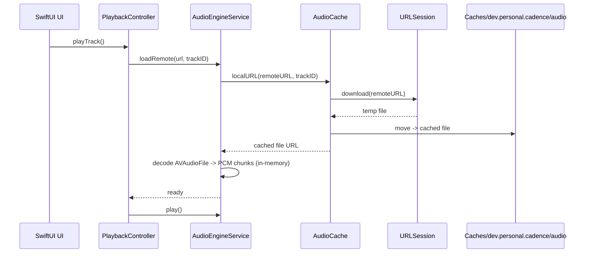
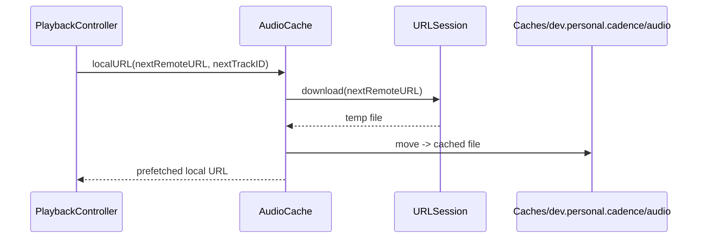
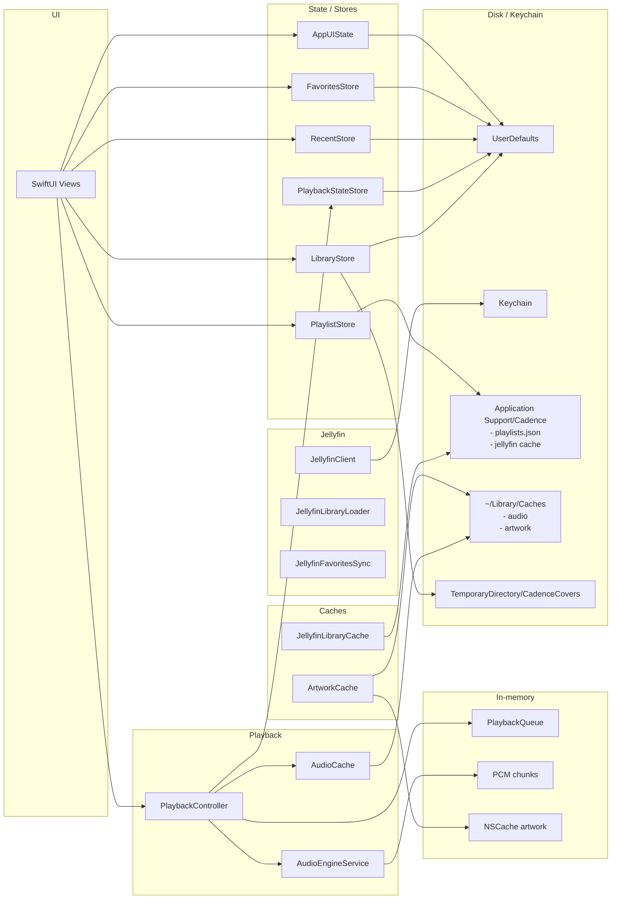

# Cadence — Техническое задание

## 1. Обзор

**Cadence** — нативный аудио-плеер для macOS с интеграцией с Jellyfin-сервером и поддержкой локальных файлов.

Ключевые ценности: нативный macOS-опыт, стабильное воспроизведение, полная интеграция с Jellyfin, качественная работа со звуком (эквалайзер).

---

## 2. Технический стек

| Компонент | Технология |
|---|---|
| Язык | Swift |
| UI | SwiftUI |
| Аудио-движок | AVFoundation + Core Audio (AVAudioEngine) |
| Сеть | URLSession / async-await |
| Persistence | UserDefaults + JSON в Application Support + FileManager (Caches/Temp) |
| Минимальная macOS | 14.0 (Sonoma) |
| Внешние зависимости | Минимум. Jellyfin API — собственный клиент поверх REST API |

---

## 3. Источники аудио

### 3.1 Jellyfin

Фактическая реализация:

- **Аутентификация**: логин/пароль или API key; токены сохраняются в Keychain; список серверов в UserDefaults; активный сервер один
- **Библиотека**: загрузка всех аудио-объектов через REST API, группировка по альбомам, формирование списка артистов; кеш библиотеки хранится на диске (Application Support)
- **Стриминг**: используется `/Audio/{id}/universal`; перед воспроизведением трек целиком скачивается в `AudioCache`, затем читается через `AVAudioFile` (сетевой чанкинг не используется)
- **Избранное**: локальное хранение; для Jellyfin-треков выполняется синхронизация mark/unmark + первичная загрузка избранных треков с сервера

Не реализовано:

- Плейлисты Jellyfin (CRUD) и рейтинги
- Scrobbling (методы есть в `JellyfinClient`, но не вызываются)
- Явный контроль транскодинга — используется универсальный endpoint Jellyfin

### 3.2 Локальные файлы

- Добавление через File → Open Music Folder… (⌘O)
- Сканирование выбранной папки и подпапок; треки попадают в общую библиотеку
- Поддерживаемые форматы: FLAC, ALAC, MP3, AAC, M4A, OGG, WAV, AIFF/AIF, Opus
- Чтение метаданных из тегов файлов через AVFoundation
- Security-scoped bookmarks для восстановления доступа между сессиями

---

## 4. Воспроизведение

### 4.1 Аудио-движок

Построен на **AVAudioEngine**.

Цепочка: `AVAudioPlayerNode` → `AVAudioUnitEQ` → `AVAudioEngine.mainMixerNode` → `output`.

Факт реализации:

- Трек декодируется в PCM-чанки (~1 сек по sampleRate) в памяти и планируется в плеере батчами
- Для удалённых треков файл сначала скачивается в `AudioCache`, затем декодируется через `AVAudioFile`

### 4.2 Управление воспроизведением

- Play / Pause
- Next / Previous трек
- Seek (перемотка) с отображением позиции
- Регулировка громкости (независимая от системной)
- Очередь воспроизведения: добавление, удаление, перетаскивание в up next
- «Играть следующим» / «Добавить в очередь» доступны из контекстного меню трека

### 4.3 Режимы воспроизведения

- **Repeat**: выключен / повтор очереди / повтор одного трека
- **Shuffle**: выключен / включён (перемешивание оставшихся треков через `shuffle()`)

### 4.4 Gapless playback

Не реализовано. Переход происходит после завершения трека, prefetch используется только для загрузки файла следующего трека.

---

## 5. Эквалайзер

### 5.1 Тип

Графический эквалайзер: **10 полос** (стандартные частоты: 32, 64, 125, 250, 500, 1K, 2K, 4K, 8K, 16K Hz).

Реализация через `AVAudioUnitEQ` с 10 `AVAudioUnitEQFilterParameters` (параметрический тип `.parametric`, но UI представлен как графический — пользователь двигает слайдеры gain для каждой полосы).

Диапазон gain в UI: от -12 dB до +12 dB.

### 5.2 Пресеты

Встроенные пресеты: Flat, Rock, Pop, Jazz, Classical, Electronic, Hip-Hop, Acoustic, Bass Boost, Vocal Boost.

Пользовательские пресеты не реализованы (есть только ручная настройка с сохранением текущих gain в состоянии).

### 5.3 UI эквалайзера

- Отдельное окно или панель (sheet), вызываемое из меню или тулбара
- 10 вертикальных слайдеров с подписями частот
- Выпадающий список пресетов
- Кнопка вкл/выкл эквалайзера (bypass)
- Визуальная кривая частотного отклика не реализована

---

## 6. Обложки альбомов

### 6.1 Источники обложек (по приоритету)

1. Jellyfin API: `/Items/{id}/Images/Primary`
2. Встроенные в метаданные файла (embedded artwork)
3. Файлы рядом с аудио: `cover.jpg`, `cover.png`, `folder.jpg`, `folder.png`, `front.jpg`, `front.png`, `artwork.jpg`, `artwork.png`

### 6.2 Отображение

- В панели «Сейчас играет» — крупная обложка
- В списках треков/альбомов — миниатюры
- Плейсхолдер для треков без обложки (нотная иконка или градиент)

### 6.3 Кеширование

- Обложки из Jellyfin кешируются на диск (`~/Library/Caches/Cadence/artwork/`)
- В памяти используется `NSCache` (countLimit = 200)
- Размеры: запрашиваем подходящий размер у Jellyfin API, не грузим оригинал

---

## 7. Кеширование аудио и офлайн

### 7.1 AudioCache (удалённые треки Jellyfin)

- При воспроизведении удалённого трека файл полностью скачивается через `URLSession.download`
- Диск: `~/Library/Caches/dev.personal.cadence/audio/`
- Лимит кеша: 2 ГБ по умолчанию (UI-настройка пока не применяется к `AudioCache`)
- Вытеснение LRU по дате доступа при каждом новом скачивании

### 7.2 Prefetch следующего трека

- После старта трека `PlaybackController` пытается скачать следующий удалённый трек
- Prefetch сохраняется как локальный файл и используется при следующем переходе

### 7.3 Офлайн-режим

- Отдельного офлайн-режима и явных офлайн-загрузок нет
- Раздел «Скачанное» показывает локальные файлы пользователя, а не удалённые загрузки

---

## 8. UI / UX

### 8.1 Общая структура окна

```
┌─────────────────────────────────────────────────────────────────┐
│  Toolbar: навигация назад/вперёд, поиск                         │
├───────────┬──────────────────────────────┬──────────────────────┤
│           │                              │                      │
│  Sidebar  │           Content Area       │     Queue Panel      │
│           │   (альбомы/артисты/треки/    │     (опционально)    │
│  - Сейчас │    плейлисты/избранное/      │                      │
│    играет │    недавнее/скачанное)       │                      │
│  - Библ.  │                              │                      │
│  - Плейл. │                              │                      │
│  - Избр.  │                              │                      │
│           │                              │                      │
├───────────┴──────────────────────────────┴──────────────────────┤
│  Now Playing Bar: обложка, трек/артист, controls, прогресс,     │
│  громкость, shuffle, repeat, queue, EQ                          │
└─────────────────────────────────────────────────────────────────┘
```

### 8.2 Навигация в Sidebar

- **Сейчас играет** — детальный Now Playing
- **Библиотека**:
  - Все треки
  - Альбомы
  - Артисты
- **Плейлисты**:
  - Локальные плейлисты (создаются в приложении)
  - «Создать плейлист»
- **Избранное**
- **Недавнее**
- **Скачанное** (локальные файлы пользователя)

### 8.3 Content Area

- **Список треков**: колонки (#, название, альбом, длительность), контекстное меню (play, play next, add to queue, add to playlist, favorite, показать в Finder)
- **Сетка альбомов**: обложки с названием и артистом → страница альбома
- **Сетка артистов**: переход к артисту
- **Страница альбома**: обложка, метаданные, треклист
- **Плейлист**: список треков из локального плейлиста
- **Избранное / Недавнее / Скачанное**: списки треков

Сортировка по колонкам и рейтинги не реализованы.

### 8.4 Now Playing Bar (нижняя панель)

Всегда видна, когда что-то играет:

- Обложка (миниатюра) + название трека + артист (клик → переход к «Сейчас играет»)
- Кнопки: previous, play/pause, next
- Прогресс-бар (seekable) с текущим временем и длительностью
- Громкость (слайдер)
- Кнопки: shuffle, repeat (с индикацией текущего режима)
- Кнопка очереди (открывает панель очереди справа или popup)
- Кнопка EQ (открывает окно эквалайзера)
- Кнопка избранного для текущего трека

### 8.5 Мини-плеер

Не реализован.

### 8.6 Тёмная и светлая тема

- Полная поддержка system / light / dark
- Выбор темы хранится только в памяти (без персистентного сохранения)

### 8.7 Поиск

- Фильтрация локальной библиотеки по трекам/альбомам/артистам
- Серверный поиск Jellyfin не реализован

---

## 9. Системная интеграция macOS

### 9.1 Media Keys и Now Playing

- Перехват media keys (play/pause, next, previous) через `MPRemoteCommandCenter` + локальный монитор событий `NSEvent`
- `MPNowPlayingInfoCenter` публикует название, артиста, альбом, длительность и позицию
- Обложка в системном Now Playing не задаётся

### 9.2 Меню приложения

Полноценное macOS-меню:

- **Cadence**: About, Preferences (⌘,), Quit (⌘Q)
- **File**: Open Music Folder… (⌘O)
- **Playback**: Play/Pause (Space), Next Track, Previous Track
- **View**: Toggle Sidebar (⌘B), Toggle Queue (⌘L), Show Equalizer (⌘E)
- **Window**: стандартные macOS window commands

### 9.3 Горячие клавиши

| Действие | Клавиша |
|---|---|
| Play / Pause | Space |
| Preferences | ⌘, |
| Open Music Folder | ⌘O |
| Toggle Sidebar | ⌘B |
| Toggle Queue | ⌘L |
| Equalizer | ⌘E |

### 9.4 Dock

Dock menu не реализован (используется стандартное поведение).

### 9.5 Drag & Drop

- Drag & Drop из Finder не реализован
- В очереди реализовано перетаскивание элементов для изменения порядка

---

## 10. Настройки

Фактические вкладки:

- **Серверы**: список Jellyfin-серверов, добавление/удаление, выбор активного; кнопка «Проверить связь» без логики
- **Воспроизведение**: UI для выхода, громкости по умолчанию, gapless и crossfade — значения пока не применяются к движку
- **Кеш**: показывает суммарный размер (artwork + audio + library cache), слайдер максимального размера не влияет на `AudioCache`, есть очистка кеша
- **Скачанное**: информационный блок без управления загрузками
- **Внешний вид**: system / light / dark (состояние хранится в памяти)

---

## 11. Сохранение состояния

При закрытии и повторном открытии приложения восстанавливаются:

- Текущий трек и позиция воспроизведения
- Очередь воспроизведения
- Режимы shuffle / repeat
- Настройки эквалайзера
- Громкость
- Активный сервер Jellyfin

Фактическое хранение:

- `UserDefaults`: playback state, избранное, недавние треки, список серверов, bookmarks папок
- `Application Support/Cadence`: `playlists.json`, кеш библиотеки Jellyfin
- `~/Library/Caches`: artwork, audio cache

---

## 12. Обработка ошибок

Фактическая обработка:

- Ошибки загрузки библиотек/сканирования логируются через `os_log`
- Ошибка загрузки трека: лог + переход к следующему треку
- Ошибка восстановления playback state: сброс состояния очереди
- UI-уведомления, retry и офлайн-режим не реализованы

---

## 13. Accessibility

Явных доработок accessibility нет. Используются стандартные возможности SwiftUI.
Частично учитывается `Reduce Motion` для анимаций Now Playing и боковых панелей.

---

## 14. Архитектура

### 14.1 Основные модули

- **SwiftUI Views**: `MainWindowView`, `SidebarView`, `ContentAreaView`, `NowPlayingBarView`, `NowPlayingDetailView`, `QueuePanelView`, `EQWindowView`, `PreferencesWindowView`
- **State/Stores**: `AppUIState`, `LibraryStore`, `PlaylistStore`, `FavoritesStore`, `RecentStore`, `PlaybackStateStore`
- **Playback**: `PlaybackController` → `AudioEngineService` + `AudioCache`
- **Jellyfin**: `JellyfinClient`, `JellyfinLibraryLoader`, `JellyfinFavoritesSync`
- **Caches**: `ArtworkCache`, `JellyfinLibraryCache`
- **System**: `MediaRemoteService`, `PlaybackKeyboardMonitorService`

### 14.2 Потоки данных

- UI получает доступ к состоянию через `@Environment` и реагирует на изменения Observable-объектов
- `PlaybackController` является единой точкой управления аудио, очередью, repeat/shuffle и сохранением состояния
- `LibraryStore` объединяет локальную библиотеку и Jellyfin, делая один список для UI

### 14.3 Диаграммы последовательностей

**Удалённый трек: скачивание и воспроизведение (факт)**



**Prefetch следующего удалённого трека**



### 14.4 Диаграмма компонентов и хранилищ



---

## 15. Статус реализации

Реализовано:

1. SwiftUI shell: окно, сайдбар, контент, Now Playing bar
2. Подключение к Jellyfin (логин/пароль, API key), кеш библиотеки
3. Локальная библиотека из папок с security-scoped bookmarks
4. Очередь воспроизведения, shuffle / repeat
5. Эквалайзер 10 полос + встроенные пресеты
6. Избранное (локально + синхронизация треков с Jellyfin)
7. Локальные плейлисты
8. Media keys + `MPNowPlayingInfoCenter`

Не реализовано:

- Jellyfin-плейлисты, рейтинги, scrobbling
- Офлайн-режим и явные загрузки
- Gapless / crossfade
- Серверный поиск
- Мини-плеер
- Пользовательские EQ-пресеты и кривая EQ
- Drag & Drop из Finder и Dock menu

---

## 16. Ограничения и заметки

- Лимит `AudioCache` задаётся в коде (2 ГБ); слайдер в Preferences пока не влияет
- Метаданные аудио (битрейт/частота/каналы) в Now Playing UI не вычисляются
- Темы и часть настроек не персистятся (кроме перечисленного в разделе 11)
